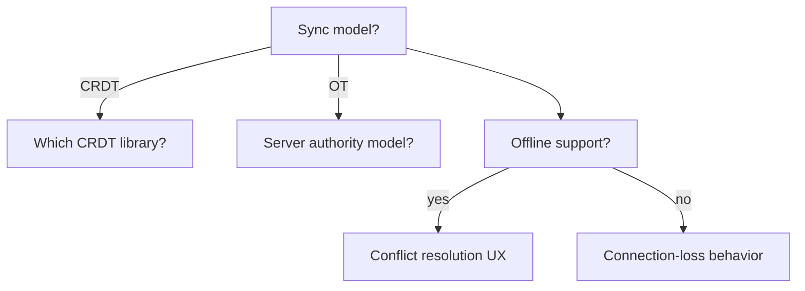

# Decision Elicitation

## Purpose

Get from "I want to build this" to "this is buildable" by finding every decision
the request depends on, discarding the ones that don't block anything, and
putting the rest to the person who owns them — one at a time, each with a
recommendation and the reason behind it.

**Governing principle: this skill terminates.** Its job is to reach the point
where implementation can start, not to explore the design space exhaustively.
Every question must be traceable to something that cannot be built without the
answer. An interrogation that keeps finding new things to ask has stopped serving
the user and started performing thoroughness — that is this skill's characteristic
failure, and the pruning step in Procedure 2 exists specifically to prevent it.

Two things are never confused: **facts** and **decisions**. A fact is discoverable
— what framework this repo uses, whether an endpoint exists, what the current
schema is. Facts get looked up, never asked. A decision is the user's to make and
cannot be derived from the code. Only decisions get asked. Asking the user
something you could have read is the fastest way to lose their attention for the
questions that actually need them.

## Inputs

- **The thing to be built**, at whatever fidelity it currently exists — a
  sentence, a ticket, a rough plan.
- **The codebase and its conventions**, so existing patterns constrain the tree
  rather than being re-decided. A decision the codebase has already made is not
  an open decision.
- **The scope of the first increment.** What counts as "done enough to start"
  determines which decisions are blocking, and is therefore what makes the
  completion test checkable. If it is not stated, establish it as the first
  question — it is the one question that is always blocking.
- **Any decisions already made and recorded** — ADRs, prior conversations, a
  spec. Re-asking a settled decision is the same defect as asking a fact.

## Procedure

### 1. Build the decision tree

Enumerate every decision the request implies, then establish the dependencies
between them: decision B is a **child** of A when B only exists, or changes
meaning, depending on how A resolves. Render the tree so the user can see the
shape of what they are about to be asked:



Root decisions are the ones nothing else depends on being answered first. They
are asked first, because resolving one usually deletes whole subtrees.

MUST show the tree before asking the first question. The user needs to see the
scope of the interrogation to consent to it, and a visible tree is what makes an
over-large one obvious — to you as much as to them.

### 2. Prune to what blocks

Mark every node:

- **Blocking** — the first increment cannot be built without this answer.
- **Deferrable** — it matters, but a later increment can decide it, and deciding
  it now would be guessing at information that does not exist yet.
- **Already answered** — settled by the codebase, an ADR, or the request itself.
  Say what settled it rather than asking.

**Only blocking nodes get asked.** State the counts ("11 decisions, 4 blocking")
so the user knows the shape of what is coming.

This step is what makes the skill terminate. Skipping it turns a bounded
interrogation into an unbounded one, which is the upstream failure this rework
exists to fix. A tree with no deferrable nodes is a tree that was not pruned —
look again.

### 3. Walk the blocking decisions

One decision per message. Never batch — several questions at once produces either
a skipped question or a shallow answer to all of them, and it removes the user's
ability to change direction between decisions.

Each question carries:

- **The decision**, stated as a choice between named options, not an open prompt.
- **Your recommendation**, and the reason it holds — a first-principles argument,
  a named tradeoff or pattern, or a concrete consequence of getting it wrong.
  MUST NOT state a preference with no reason behind it; "I'd suggest Postgres"
  teaches nothing and cannot be argued with.
- **What it unlocks or forecloses** — which subtree this answer prunes.

Look up every fact the environment can answer before asking anything. Between
questions, update the running checklist inline so the user can see the accumulated
state without scrolling:

```text
- [x] Sync model: OT over CRDT — single-server topology already assumed, and OT's
      server authority matches it; CRDT's merge guarantees buy nothing here
- [x] Offline: not in v1 — no stated requirement, and it doubles conflict surface
- [ ] Persistence granularity: per-keystroke vs. per-operation batch
```

When an answer prunes a subtree, say so and remove it visibly. That is the user
seeing progress, and it is the strongest signal that the process is converging.

### 4. Run the completion test

After each answer, check all three. When all three hold, the skill is **done** —
stop asking:

1. Every **blocking** node is resolved.
2. No unresolved node blocks the first increment.
3. Every **deferred** node has a named trigger — the event, milestone, or piece
   of information that forces the decision later.

MUST NOT continue past this point because interesting questions remain. Remaining
questions that pass the test are, by construction, not blocking — they belong to
the increment that will surface them. Announce completion explicitly rather than
trailing off; the user needs to know the interrogation is over.

### 5. Emit the spec and hand off

Produce the implementation-ready spec from the resolved decisions, present it as
the summary of what was agreed, and hand to `technical-planning-estimation` for
sequencing or `code-implementation` to build.

MUST NOT begin implementing until the user confirms the spec. The decisions are
theirs; a confirmed summary is what makes them theirs rather than yours.

## Output Format

```markdown
## Decision tree
<mermaid graph, with each node marked blocking / deferrable / already answered>

<counts: N decisions, M blocking>

## Decisions
<the running checklist, updated inline as the walk proceeds — each resolved entry
carries its answer AND the reason it was chosen>

## Deferred
| Decision | Why it can wait | Trigger that forces it |

## Completion
<the three tests, each shown as met>

## Implementation-ready spec
<what is being built, the decisions that shape it, and the first increment>
```

## Quality Checklist

- [ ] Tree rendered and shown before the first question.
- [ ] Every node marked blocking / deferrable / already answered, with counts stated.
- [ ] No question asked that the codebase, filesystem, or request already answers.
- [ ] Exactly one decision per message, start to finish.
- [ ] Every question carries a recommendation *and* the reason behind it.
- [ ] Checklist updated inline after each answer, not only at the end.
- [ ] Pruned subtrees named as they are pruned.
- [ ] The three completion tests explicitly checked and shown as met.
- [ ] Every deferred decision has a named trigger, not "later".
- [ ] Spec presented and confirmed before any implementation.

## Failure Conditions

- **Never terminating.** Continuing to find questions because the design space is
  large. The completion test is the boundary; past it, further questions are
  costing the user attention for decisions that were not blocking.
- **Asking what you could look up.** Every fact question spends the user's
  patience on something the filesystem would have answered for free.
- **Batching questions.** Several at once is bewildering, and it produces either
  silence on some or shallow answers to all.
- **Walking deferrable branches.** Thoroughness that does not serve the first
  increment. If pruning marked it deferrable, it does not get asked now.
- **Recommendation without reason.** A stated preference the user cannot argue
  with. The reason is what lets them overrule you correctly.
- **Skipping the tree.** Going straight to questions hides the scope of the
  interrogation and removes the user's ability to see it shrink.
- **Implementing before confirmation.** The decisions belong to the user until
  they have seen them assembled and agreed.
- **Escalate / stop** when: a blocking decision needs information nobody in the
  conversation has (name it as a spike and stop, rather than forcing a guess); the
  user declines to decide and asks you to choose (record it as your call, with
  the reason and what would reverse it, rather than pretending it was theirs); or
  the tree turns out to be entirely deferrable, meaning implementation can start
  now and this skill has nothing to do.

## Related skills

- `requirements-analysis` — turns a stated problem into testable requirements
  with acceptance criteria. This runs earlier, when the problem itself still has
  unmade choices in it, and hands over once they are settled.
- `staff-architect` — ranks which analysis lenses a project needs and dispatches.
  Run this first when the blocker is unmade decisions rather than missing
  analysis; that skill's escalation path points here.
- `technical-planning-estimation` — receives the confirmed spec and sequences it.
- `first-principles-design` — widens the option space by generating and scoring
  distinct candidates. This one closes the space instead. If the user wants
  options opened up rather than narrowed down, this is the wrong skill.

## Measuring this skill

`evaluations/` holds the activation and rubric suite; run it per
`skills/EVALUATION-GUIDE.md`. The characteristic failure is **non-termination**,
so the suite includes a case whose correct outcome is to ask nothing at all
(every decision already settled by the codebase) and one where the correct
behavior is to stop after two questions because the completion test passes while
obviously interesting questions remain unasked. Question count is a scored
metric, in the direction of fewer.
